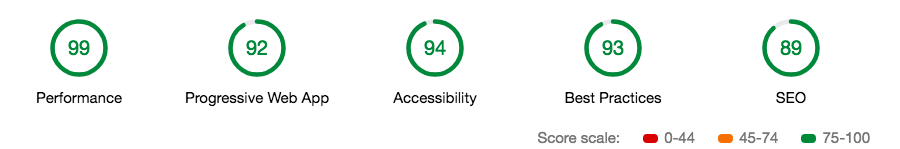

# Udacity's "Mobile Web Specialist Restaurant Reviews App" Project, Stage 3



## To run this code:

### 1) cd into serverSide, and follow the instructions below:

**Development local API Server**
_Location of server = /server_
Server depends on [node.js LTS Version: v6.11.2 ](https://nodejs.org/en/download/), [npm](https://www.npmjs.com/get-npm), and [sails.js](http://sailsjs.com/)
Please make sure you have these installed before proceeding forward.

Let's start with running commands in your terminal, known as command line interface (CLI)

**Install project dependancies**
```Install project dependancies
# npm i
```
**Install Sails.js globally**
```Install sails global
# npm i sails -g
```
**Start the server**
```Start server
# node server
```
**You should now have access to your API server environment**
debug: Environment : development
debug: Port        : 1337

### 2) cd into clientSide, and follow the instructions below:

**Check your version of Python**
```Check your version of Python
# python -V
```

If you have Python 2.x, spin up the server with
`python -m SimpleHTTPServer 8000`
(or some other port, if port 8000 is already in use.)

For Python 3.x, you can use `python3 -m http.server 8000`.

If you don't have Python installed, navigate to Python's [website](https://www.python.org/) to download and install the software.

#### With your server running, visit the site: `http://localhost:8000`

